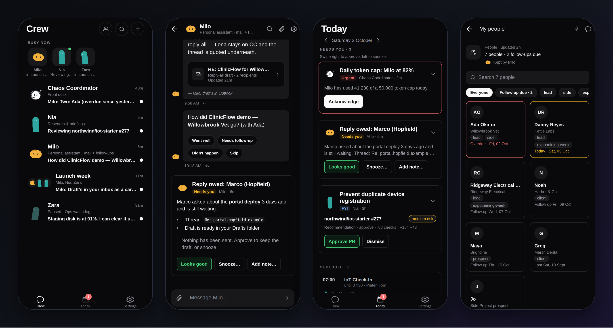
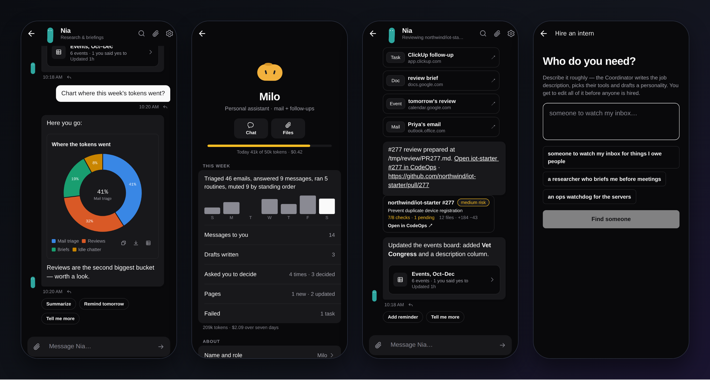
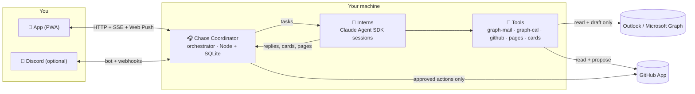
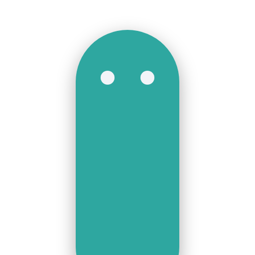
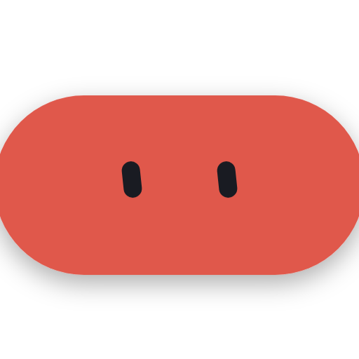

<p align="center">
  
</p>

<p align="center">
  <a href="LICENSE"></a>
  <a href="https://github.com/jpdlr/interns/actions/workflows/ci.yml"></a>
  
  
  
</p>

**Interns** is a self-hosted crew of persistent AI agents. Each intern has a name, an
animated face, a job, its own memory, its own tools and a daily budget. You talk to them
from a phone app or from Discord. They also work on their own: they triage your inbox,
brief you before meetings, review pull requests, keep track of who you owe a reply, and
report back in a morning standup.

Above them sits the **Chaos Coordinator**, which is deterministic code with a sense of
humour. It hires interns from a one-line description, routes your messages to the right
one, runs their schedules, enforces the guardrails and asks you before anything leaves
the building. Interns never send email or publish anything themselves. They draft, and
you approve.

<p align="center">
  
</p>

## What it does

- **A crew, not a chatbot.** Every intern runs as its own [Claude Agent SDK](https://docs.claude.com/en/docs/agent-sdk/overview)
  session, which resumes between tasks. Each one has its own working directory, memory
  files and allowlist of tools.
- **Hire in one sentence.** Say "someone to watch my inbox for things I owe people". The
  coordinator drafts the role, a personality, a system prompt, tools, a schedule and a
  budget. You edit any of it and pick a face, then hire. Or start from one of seven
  [starter interns](#starter-interns).
- **They work while you don't.** Cron schedules, standing backlogs, new mail, upcoming
  meetings and GitHub pull requests all become tasks. One task runs per intern at a time,
  and different interns run in parallel.
- **Cards for decisions.** When an intern needs you, it raises a card with buttons:
  approve a review, keep a draft, snooze, add a note. A card shows up in the app and on
  Discord, and resolving it in one place resolves it everywhere.
- **Living pages.** Interns keep people lists, pipelines, tables and email drafts as pages
  that they update in place, instead of re-posting tables in the chat.
- **Today.** One screen with what needs you, your meetings (with briefs written in
  advance), follow-ups due, and what the crew did while you were away.
- **Group chats and handoffs.** Put several interns in a room or `@mention` one into a
  thread. A cheap pre-check decides who should answer so everyone doesn't reply at once.
- **Standing orders.** "Ignore PRs in acme/webapp" or "hold anything from Maya until
  Monday" become rules that filter work before it reaches anyone, each with an Undo.
- **Rich replies.** Interns can answer with charts, Mermaid diagrams, SVG drawings,
  checklists and quick-reply chips. These render natively in the app and as images on
  Discord.
- **Guardrails built in.** Every intern has a daily token cap and a granted tool
  allowlist. Outbound mail is drafts-only, and side effects need an approval that runs
  exactly once.

<p align="center">
  
</p>

## How it works



1. **Something happens.** You send a message, a cron fires, mail arrives, a meeting is
   25 minutes away, or a PR opens. The orchestrator turns it into a **task** for one
   intern. Before that, it applies standing orders and the mail filters (regex rules,
   then batching, then one cheap model call that decides between "wake the intern" and
   "hold for the digest").
2. **The intern works.** The engine resumes the intern's Agent SDK session with its
   manifest, persona, allowed tools and standing orders. The intern reads, thinks, uses
   its tools, and replies in its thread, sometimes with a card or a page.
3. **You decide.** Anything that affects the outside world becomes a card. Pressing
   **Publish review** or **Keep draft** runs exactly once, whether you tapped it in the
   app or clicked it on Discord.
4. **The coordinator keeps things moving.** It gives a morning standup with a spend chart,
   proposes hires and automations from your patterns once a week, holds work when an
   intern hits its daily cap, and pauses interns on request.

The design notes are in [`docs/architecture.md`](docs/architecture.md), with feature
specs in [`docs/features/`](docs/features/). The [orchestrator README](orchestrator/README.md)
covers the API, mentions, attachments, push and approvals in depth, and the
[app README](app/README.md) covers the PWA.

## Quick start

**You need:** Linux or macOS, [Node.js 22+](https://nodejs.org), git, and access to
Claude. Interns run on the [Claude Agent SDK](https://docs.claude.com/en/docs/agent-sdk/overview),
so either sign in once with [Claude Code](https://docs.claude.com/en/docs/claude-code) on
this machine (`npx @anthropic-ai/claude-code`, then `/login`) or set `ANTHROPIC_API_KEY`
in the orchestrator's environment. Python 3.10+ is needed only for the Outlook tools.

```sh
git clone https://github.com/jpdlr/interns.git
cd interns

# 1. The orchestrator (backend)
cd orchestrator
npm ci
npm run build
npm test            # optional: offline smoke + feature tests, no API calls

# 2. The app (served by the orchestrator once built)
cd ../app
npm ci
npm run export:web

# 3. Run it
cd ../orchestrator
npm start
```

On first start the orchestrator creates `~/.interns/config.json` (mode `0600`) with a
random API token and Web Push keys, and serves the app at **http://127.0.0.1:7810**.
Open it and the setup screen walks you through the rest:

1. **Connect this device.** Paste the `api_token` from `~/.interns/config.json`. It stays
   on the device.
2. **About you.** Enter your name (what the crew calls you), your time zone (prefilled
   from the device) and, optionally, your work email domains.
3. **Who's first?** Pick a [starter intern](#starter-interns) or describe someone in your
   own words. Either way you see and can edit the whole job description before anyone is
   hired.

Two interns always exist: the **Chaos Coordinator** (your front desk) and **Forge** (who
builds missing integrations, see below).

> **Try it without credentials.** `cd app && npm run mock` starts a fake orchestrator with
> a demo crew on port 7811. Run `npx expo start --web` in another terminal and connect to
> `http://127.0.0.1:7811` with the token `test-token-abc`.

## Starter interns

Ready-made crew members in [`orchestrator/templates/`](orchestrator/templates/). Pick one in
Setup or on the Hire screen, change anything you like, and hire.

| | Intern | What they do | Needs |
| --- | --- | --- | --- |
|  | **Milo** · Inbox assistant | Watches your inbox, tells you what you owe people and drafts the replies | Outlook |
|  | **Nia** · Meeting briefer | Briefs you before meetings with outside people, asks how they went afterwards | Outlook |
|  | **Rowan** · Chief of staff | Plans your day each weekday morning from your calendar, inbox and open cards | Outlook |
|  | **Iris** · Researcher | Digs into any question on the web and comes back with a sourced answer | — |
|  | **Pia** · Writer | Turns rough notes into posts, newsletters and docs in your voice | — |
|  | **Rhea** · Code reviewer | Prepares pull request reviews that you publish with one tap | GitHub App |
|  | **Zara** · Ops watchdog | Checks this machine on a schedule and speaks up only when something's wrong | — |

A template is an ordinary intern manifest plus `summary` and `order`. To change a starter
for your install only, or add your own, put a YAML file with the same name in
`~/.interns/templates/`.

## Connecting things

Everything below is optional. Without it you still have a crew you can chat with, plus
schedules, pages, cards, group chats and the standup.

<details>
<summary><b>📱 Your phone (PWA + push)</b></summary>

The API binds to `127.0.0.1`. The easiest way to reach it from your phone is
[Tailscale](https://tailscale.com): set `"bind"` to the machine's tailnet IP, or put
HTTPS in front with `tailscale serve --bg 7810`. Then open the URL in Safari and use
**Share › Add to Home Screen**.

Web Push works on iOS 16.4+ only for apps installed to the Home Screen. Enable it in
**Settings › Notifications** and set `push.subject` to a `mailto:` address of your own.
See [app/README.md](app/README.md) for details.
</details>

<details>
<summary><b>📧 Outlook mail and calendar (Microsoft Graph)</b></summary>

Interns get two CLIs. `graph-mail` can read mail and create **drafts**; it has no send
command. `graph-cal` is **read-only**.

1. In the [Microsoft Entra admin center](https://entra.microsoft.com), go to
   **App registrations › New registration**. Any name works. Choose who can sign in.
2. Under **Authentication**, turn on **Allow public client flows** (this enables device
   code sign-in). No secret is needed.
3. Under **API permissions**, add the delegated Microsoft Graph permissions
   `Mail.ReadWrite` and `Calendars.Read`.
4. Copy the **Application (client) ID** into `~/.interns/config.json`:

   ```json
   "graph": { "client_id": "00000000-0000-0000-0000-000000000000", "authority": "organizations" }
   ```

   Use `"common"` or `"consumers"` as the authority for personal Microsoft accounts.
5. Install the one Python dependency and sign in to each mailbox:

   ```sh
   python3 -m venv orchestrator/.venv
   orchestrator/.venv/bin/pip install -r orchestrator/tools/requirements.txt
   orchestrator/tools/graph-login --mailbox work      # prints a code for microsoft.com/devicelogin
   ```

   This stores a token cache in `~/.interns/mailboxes/work/` and adds `work` to
   `"mailboxes"`. Repeat for other mailboxes. The first one is the default, and
   `calendar_mailbox` picks the calendar used for meeting briefs.
6. Set `own_domains` to your organisation's email domains. Meetings with anyone outside
   them get a brief beforehand and a short "how did it go?" afterwards. Restart the
   orchestrator.

Give an intern the `mail` / `calendar` tools and the `mail_push` / `meeting_brief`
triggers, either when hiring or on its profile.
</details>

<details>
<summary><b>🐙 GitHub pull request reviews</b></summary>

A reviewer intern reads PRs through a **GitHub App**, which uses short-lived tokens, and
prepares reviews that are only published when you press **Publish review**.

- Create a private GitHub App with **Metadata: read**, **Contents: read**, **Checks:
  read** and **Pull requests: read & write**, and install it on the repositories you
  want reviewed. `npm run setup:github -- https://YOUR-HOST/github-setup YOUR_LOGIN`
  walks you through it with a manifest flow (it needs an HTTPS URL that reaches this
  machine, e.g. Tailscale Funnel).
- Or fill in `github.app_id`, `github.installation_id`, `github.private_key_path` (keep
  the key outside the repo) and the `github.repositories` allowlist by hand.
- Webhooks are optional; the orchestrator polls every `github.poll_minutes`.

Hiring a code reviewer then shows `github` as a missing capability. Approving it
activates the tool for that intern. See
[orchestrator/README.md › GitHub App setup](orchestrator/README.md#github-app-setup).
</details>

<details>
<summary><b>💬 Discord</b></summary>

The orchestrator can mirror the office into a Discord server. Each intern gets a channel
and posts under its own name and face. The coordinator lives in `#office`. Cards become
embeds with buttons.

1. Create an application and bot in the [Discord developer portal](https://discord.com/developers/applications)
   and turn on the **Message Content** intent.
2. Invite it to your server with permission to manage channels and webhooks, send
   messages, embed links and attach files.
3. Set `discord.bot_token`, `discord.guild_id` and `discord.office_channel_id`, and
   `discord.avatar_base_url` if the face PNGs are hosted somewhere. Then set
   `discord.dry_run` to `false`. Until you do, every send is only logged.
</details>

## Configuration

All settings live in `~/.interns/config.json`; set `INTERNS_HOME` to move the whole
directory. [`orchestrator/config.example.json`](orchestrator/config.example.json) shows
every key. The ones you'll most likely touch:

| Key | Default | What it does |
| --- | --- | --- |
| `owner_name` | `"Boss"` | What the interns call you |
| `timezone` | this machine's | IANA zone for Today, local dates and calendar times |
| `bind` / `port` | `127.0.0.1` / `7810` | Where the API and app are served |
| `standup_cron` | `0 7 * * 1-5` | Morning standup (cron, in your `timezone`; so are interns' schedules) |
| `engine.model` | SDK default | Model for intern sessions |
| `engine.permission_mode` | `dontAsk` | `dontAsk` enforces each intern's tool grants; see [Safety](#safety) |
| `mailboxes`, `graph.client_id` | none | Outlook mailboxes (see above) |
| `own_domains` | `[]` | Your organisations; everyone else counts as external |
| `mail_triage.*` | newsletters/noreply ignored | Regex filters, plus `vip_from` to skip batching |
| `github.*` | off | GitHub App credentials and the repository allowlist |
| `discord.*` | `dry_run: true` | Discord bot settings |

Each intern is a YAML file at `~/.interns/<slug>/intern.yaml` (role, persona, system
prompt, tools, triggers, backlog, guardrails). You can edit it from the intern's profile
in the app or in any text editor.

## Your own install

Keep one checkout of this repository and put everything personal outside it, so
`git pull` never conflicts with your setup:

| What | Where |
| --- | --- |
| Settings, secrets, your name and time zone, mailboxes | `~/.interns/config.json` |
| Your crew (each intern's manifest, memory and files) | `~/.interns/<slug>/` |
| Your own or tweaked starter interns | `~/.interns/templates/*.yaml` |
| Service environment (e.g. `INTERNS_APP_DIST`) | a systemd drop-in, `systemctl --user edit interns-orchestrator` |
| The Python venv for the Outlook tools | `orchestrator/.venv` (ignored by git; a symlink works) |
| Any other local-only file in the checkout | add it to `.git/info/exclude` |

For example, a personal machine that lets every intern run any tool, with work mail and
a company PR viewer, only needs this in its config:

```json
{
  "owner_name": "Sam",
  "timezone": "Europe/London",
  "own_domains": ["example.com"],
  "mailboxes": ["work", "personal"],
  "engine": { "permission_mode": "bypassPermissions" },
  "github": { "codeops_base_url": "https://codeops.example.com", "codeops_owners": ["example-org"], "codeops_label": "CodeOps" }
}
```

To update: `git pull`, then rebuild (below) and restart.

## Running it as a service

[`docs/interns-orchestrator.service`](docs/interns-orchestrator.service) is a systemd
**user** unit. Copy it to `~/.config/systemd/user/`, point `WorkingDirectory` at your
checkout, then run `systemctl --user enable --now interns-orchestrator`. To keep it
running while you're logged out, run `loginctl enable-linger $USER`. After pulling
changes, run `npm ci && npm run build` in `orchestrator/` and `npm run export:web` in
`app/`, then restart the service.

## Safety

Interns act on your behalf with your credentials, so the guardrails are deliberately
boring:

- **Tool grants are enforced.** Under the default `engine.permission_mode: "dontAsk"`, an
  intern can use only the tools in its manifest, plus read/write access to its own
  directory. Every other tool call is denied. `"bypassPermissions"` lets any intern run
  any tool, shell included, whatever its manifest says. Only use it on a machine and user
  account you'd hand to the agents outright.
- **No send, no publish.** `graph-mail` has no send command; drafts land in your Drafts
  folder. `graph-cal` is read-only. Interns can only *propose* GitHub reviews, and the
  backend publishes one after you approve it, exactly once.
- **Budgets.** Every intern has a daily token cap. At the cap, its work is held and you
  get a card offering to raise the limit for the day.
- **Untrusted input.** Mail, PRs and web pages can contain prompt injection. Keep tool
  grants minimal for interns that read outside content. Give `shell` and `fs.write` only
  to interns that need them.
- **Secrets stay out of git.** Tokens and keys live in `~/.interns/` (mode `0600`). The
  API requires a bearer token, and attachment URLs are HMAC-signed.

Interns uses your Claude account or API key. Every model call it makes, including the
coordinator's small judgment calls, counts toward your usage; the Spend screen shows it
per intern and per conversation.

To report a vulnerability, see [SECURITY.md](SECURITY.md).

## Meet the crew

Twenty hand-drawn faces, each with its own idle animation (blinks, glances, nods, a
wink). All of it is pure CSS inside under 4 KB of SVG, so they keep moving even in iOS
Low Power Mode.

<p align="center"></p>

## Project layout

```
orchestrator/   TypeScript backend: API, task queue, Agent SDK engine, Discord, watchers
  src/          the orchestrator itself (start at index.ts)
  tools/        CLIs the interns call: graph-mail, graph-cal, github, intern-card, intern-page …
  scripts/      smoke + feature tests (offline: fake engine, temp HOME, no network)
  templates/    ready-made intern manifests
app/            Expo / React Native app, exported as a PWA
  app/          screens (expo-router)
  src/          API client, live SSE state, UI components, chart/mermaid renderers
  tools/        mock orchestrator, Playwright checks
avatars/        the animated faces (SVG) and PNG exports for Discord
docs/           architecture, feature specs, systemd unit, README art
```

## Development

```sh
cd orchestrator && npm run dev        # tsx watch; uses ~/.interns (set INTERNS_HOME to sandbox it)
cd orchestrator && npm test           # smoke, features, GitHub, mail/meeting watchers, graph-mail
cd app && npm run typecheck && npm run check:schedule
cd app && npm run mock                # demo backend on :7811 for UI work
python3 docs/images/build-art.py      # rebuild the README art from the faces
```

Contributions are welcome; [CONTRIBUTING.md](CONTRIBUTING.md) has the ground rules. Code
comments sometimes say "JP": that's the person the crew was first built for, and it means
"the owner".

## License

[MIT](LICENSE) © Jean-Pierre de la Rey.

Interns is an independent project and isn't affiliated with or endorsed by Anthropic.
"Claude" is a trademark of Anthropic, PBC.
